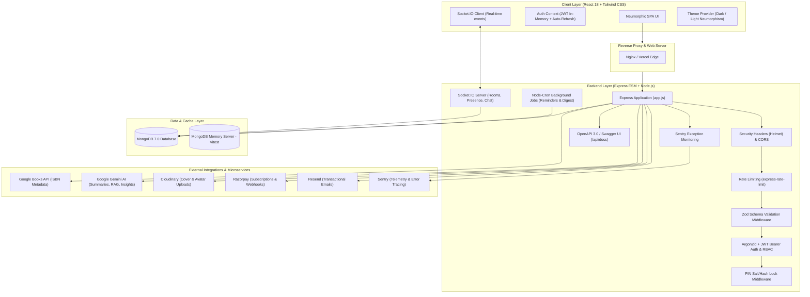
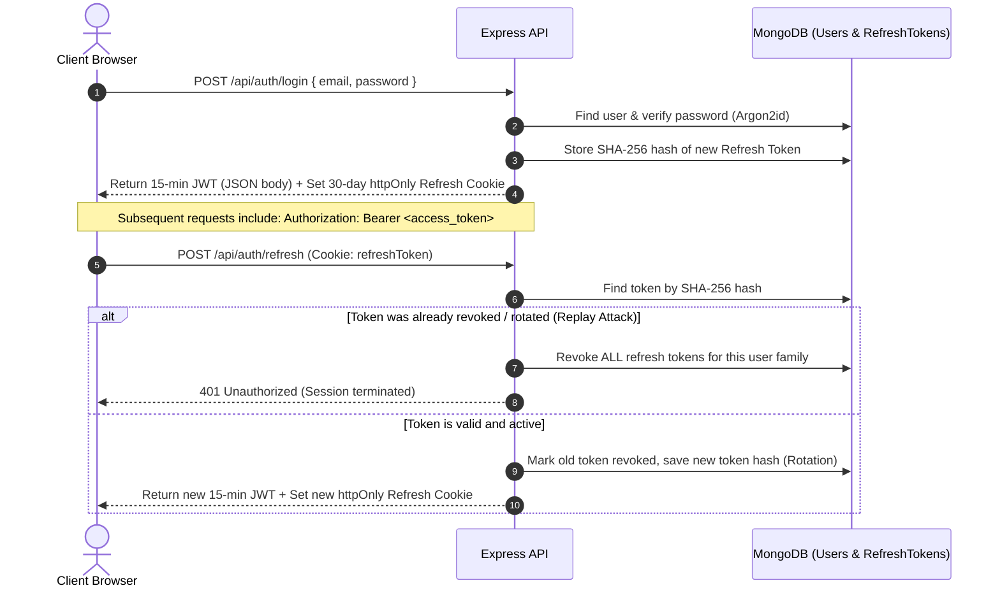
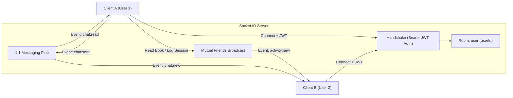

# Personal Library Tracker (Library Nest)

A production-grade, full-stack MERN reading tracker and social library platform featuring page-by-page progress tracking, reading streaks and heatmap calendars, real-time activity feeds and 1:1 chat, AI-powered reading insights, recurring subscriptions, and a PIN-secured personal reading diary.

---

## Demo

- **Live Application:** [https://personal-library-tracker.vercel.app](https://personal-library-tracker.vercel.app) _(Deployment link)_
- **API Swagger Documentation:** [http://localhost:5001/api/docs](http://localhost:5001/api/docs)
- **Health Check Endpoint:** [http://localhost:5001/health](http://localhost:5001/health)

### Quick Local Demo (via Docker)

```bash
docker compose up --build
```

Open **[http://localhost:3000](http://localhost:3000)** in your browser to access the complete application with zero manual configuration.

---

## Architecture

The system follows a decoupled client-server architecture built on Node.js/Express (ESM) and React 18, featuring real-time WebSockets, scheduled background workers, in-memory test isolation, and seamless external API integrations.



---

## Features

### 🔐 Authentication & Security Hardening

- **Dual-Token System:** Short-lived 15-minute Bearer JWT access tokens kept in memory paired with 30-day rotated httpOnly cookies for refresh tokens.
- **Argon2id Password Hashing:** Industry-standard Argon2id hashing with transparent on-the-fly migration from legacy bcrypt upon login.
- **Refresh Token Rotation & Reuse Detection:** Every refresh invalidates the current token and issues a new pair. If a revoked token is replayed, the entire active token family for that user is immediately invalidated to halt session hijacking.
- **Role-Based Access Control (RBAC):** Native `user` and `admin` roles, complete with an administrative dashboard for system user audit, role assignment, and suspension.
- **Security Middleware:** Strict CORS policies, Helmet header protection, and IP-rate-limiting (`express-rate-limit`).

### 📚 Book Catalog & Smart Metadata

- **Status Lifecycle:** Granular status workflow: `wantToRead`, `reading`, `completed`, `dnf` (Did Not Finish), and `onHold`.
- **ISBN Lookup & Autofill:** Auto-populates title, author, description, page count, genres, and cover images from Google Books API using ISBN-10 or ISBN-13.
- **Intelligent Deduplication:** Enforces unique compound constraints per user on both `ISBN` and normalized `title + author` to eliminate accidental duplicates.
- **Bulk Import & Export:** One-click CSV/JSON export of your entire library (with reviews, quotes, and shelf assignments) and PapaParse-powered bulk CSV import with instant validation and duplicate skipping.
- **Multi-Facet Search & Filtering:** Server-side search with MongoDB compound indexes, filtering across status, genre, tags, shelves, and minimum star rating, combined with pagination.

### ⏱️ Reading Progress & Habit Tracking

- **Page-by-Page Progress Tracking:** Interactive reading progress bar that auto-calculates percentages and transitions books to `completed` upon reaching 100% while capturing completion timestamps.
- **Detailed Session Logging:** Record dates, duration in minutes, start/end pages, and session notes.
- **Streak Calculation:** Server-side consecutive reading streak calculation capable of detecting gap days.
- **Activity Calendar Heatmap:** 365-day GitHub-style interactive heatmap displaying daily page velocity and session frequency.

### ⭐ Reviews, Shelves, Tags & Quotes

- **Half-Star Ratings:** Precise 0.5 to 5.0 star ratings with intuitive click-and-hover controls.
- **Written Reviews & Scratchpad Notes:** Markdown-supported public/private book reviews alongside dedicated private study scratchpad notes.
- **Custom Shelves:** Create custom thematic collections (e.g., "Favorites", "Tech Reads", "Classics") holding books across any status.
- **Tags & Quote Journal:** Tag books with custom keywords and log page-referenced memorable quotes with quick search.

### 📊 Goals & Analytics Dashboard

- **Reading Challenges:** Set yearly and monthly targets by book count or total pages with live completion indicators.
- **Visual Analytics:** Interactive Recharts charts detailing monthly reading velocity, pages read over time, genre distribution, author breakdowns, and rating spreads.

### 💬 Real-Time Social Layer & 1:1 Chat

- **Mutual Friend System:** Search users, send/accept/decline friend requests, and display live online/offline presence indicators.
- **Live Activity Feed:** Broadcasts events to mutual friends whenever a book is added, completed, rated, or a reading streak milestone is reached.
- **Instant 1:1 Chat:** Real-time messaging between friends via Socket.IO rooms featuring live unread counters, typing indicators, and real-time read receipts.

### 📖 Personal Diary with Dedicated PIN Lock

- **Independent Security Boundary:** Journal entries protected behind a dedicated 4-to-6 digit numeric PIN with separate cryptographic salt/hash verification.
- **PIN Session Protection:** Time-bounded `x-diary-token` authentication header required for accessing diary records.
- **Rich Media & Prompts:** Support for up to 4 Cloudinary-backed photo attachments per entry, daily creative writing prompts, and emotional streak tracking.

### 🤖 AI-Powered Capabilities (Google Gemini)

- **Spoiler-Light Book Summaries:** Quick, spoiler-safe AI summaries cached directly on the book document to minimize API token consumption.
- **Semantic Book Similarity:** Vector embeddings and Atlas vector cosine similarity finding related books based on narrative themes and topics.
- **"Ask Your Diary" (RAG):** Natural language Q&A over past diary reflections with source entry citations, strictly gated behind the PIN lock.
- **Reading Habit Insights:** AI-generated observations on reading velocity, preferred genres, and pacing trends.
- **AI Review Drafting:** Converts rough bullet points into polished, eloquent book reviews.
- **Natural Language Library Search:** Translates conversational queries (e.g., _"short fantasy books I loved last summer"_) into MongoDB query filters.

### 💳 Monetization & Library Pro (Razorpay)

- **Tiered Access:** Free tier (10 monthly AI calls, basic analytics) and "Library Pro" (₹99/month for unlimited AI, advanced analytics, custom themes, and Pro badge).
- **Cryptographic Webhook Handlers:** Raw body signature verification handling `subscription.activated`, `charged`, `halted`, and `cancelled`.
- **Idempotency Safeguards:** `ProcessedWebhookEvent` tracking to guarantee duplicate webhook deliveries are never processed twice.

### 🔔 Notifications & Transactional Email

- **Unified Notification Drawer:** Real-time socket delivery combined with persistent in-app notifications.
- **Automated Cron Jobs (`node-cron`):**
  - Daily reading nudges for active books without logged sessions.
  - Weekly goal-pacing alerts.
  - "Continue reading" reminders for books untouched for 5+ days.
  - Streak milestone celebrations (7, 30, 100 days).
- **Transactional Emails (`Resend`):** Modern HTML emails for welcome onboarding, secure 30-minute password resets, subscription receipts, and opt-in weekly reading digests.

### 🎨 Neumorphic Modern UI

- **Custom Soft Neumorphic Design System:** Handcrafted Tailwind CSS neumorphic elevation system (`shadow-neu`, `shadow-neu-inset`, `shadow-neu-lg`).
- **Dark & Light Mode:** Persistent theme engine syncing with system preferences.
- **Mobile Responsive Drawer:** Smooth off-canvas slide-out sidebar navigation with keyboard `Esc` shortcuts.

---

## Tech Stack

| Layer                       | Technologies                                                                              |
| --------------------------- | ----------------------------------------------------------------------------------------- |
| **Frontend Core**           | React 18, React Router v6, Axios                                                          |
| **Styling & Design**        | Tailwind CSS v3, Neumorphic Custom Design System, Lucide React Icons                      |
| **Data Visualization**      | Recharts 3 (Bar, Line, Pie, and Area Charts)                                              |
| **Real-Time Client**        | Socket.IO Client v4                                                                       |
| **Client Utilities**        | PapaParse (CSV Parsing), Sentry React SDK (Error Boundaries)                              |
| **Backend Runtime**         | Node.js (ESM), Express.js v4                                                              |
| **Database & ODM**          | MongoDB 7.0, Mongoose v7                                                                  |
| **Validation & Security**   | Zod, Argon2id, Bcryptjs, JSON Web Tokens (JWT), Cookie-Parser, Helmet, Express-Rate-Limit |
| **Real-Time Server**        | Socket.IO v4 (WebSocket Server with Room Subscriptions)                                   |
| **Scheduled Jobs**          | Node-Cron v3                                                                              |
| **File Storage**            | Multer, Cloudinary SDK, Multer-Storage-Cloudinary                                         |
| **Payment Gateway**         | Razorpay SDK (Subscriptions & Webhooks)                                                   |
| **Email Service**           | Resend SDK                                                                                |
| **Artificial Intelligence** | Google Gemini API (`@google/generative-ai` / `node-fetch`)                                |
| **Monitoring & Docs**       | Sentry Node SDK, Swagger UI Express, Swagger-JSDoc (OpenAPI 3.0)                          |
| **Testing**                 | Vitest, Supertest, MongoDB Memory Server, React Testing Library, Playwright (E2E)         |
| **DevOps & Tooling**        | Docker, Docker Compose, Nginx, GitHub Actions, ESLint, Prettier, Husky, Lint-Staged       |

---

## System Design

### 1. Dual-Token Authentication Lifecycle & Replay Protection



### 2. Real-Time WebSockets Architecture



- **Authentication Handshake:** Every socket connection must provide a valid JWT access token; unauthenticated handshakes are rejected immediately.
- **Room Isolation:** Users automatically join isolated rooms keyed to their ID (`user:{userId}`) for direct notifications, friend requests, and read receipts.
- **Friend Event Fanout:** When an activity occurs (e.g. `book_completed` or `book_rated`), the event is queried and dispatched strictly to the socket rooms of confirmed mutual friends.

### 3. Isolated Security Boundary: Diary PIN Lock

The Personal Diary feature provides a distinct, secondary security layer separating reading activity from private reflections:

```
[ Incoming Request ]
         │
         ▼
[ authMiddleware: Validates User JWT ] ──▶ (401 if invalid)
         │
         ▼
[ diaryMiddleware: Checks User.diaryLockEnabled ]
   ├── Disabled ──▶ Proceed to Controller
   └── Enabled  ──▶ Inspect 'x-diary-token' header
                      ├── Valid session token   ──▶ Proceed to Controller
                      └── Missing / Invalid      ──▶ 423 Locked
```

- When the PIN lock is active, the diary content cannot be viewed, edited, or fed into AI queries (`/api/diary/ask`) without unlocking the session via `POST /api/diary/lock/verify-pin`.

### 4. Idempotent Payment Webhook Processing

Razorpay webhooks use an immutable raw body buffer capture (`express.raw()`) mounted prior to standard JSON parsing. When a webhook arrives:

1. The HMAC SHA-256 signature is calculated over the raw body buffer and verified against `RAZORPAY_WEBHOOK_SECRET`.
2. The controller checks `ProcessedWebhookEvent` in MongoDB using the unique `x-razorpay-event-id`.
3. If the event ID was previously processed, the server immediately acknowledges with `200 OK` (idempotency safety).
4. Subscription records and user `isPro` flags are updated accordingly.

### 5. Graceful Service Degradation

The entire backend is designed with a **zero-hard-dependency philosophy**. Optional third-party services (Razorpay, Cloudinary, Resend, Gemini AI, and Sentry) degrade gracefully when API keys are absent:

- Without `GEMINI_API_KEY`, AI routes return descriptive `503 Service Unavailable` responses with fallback messaging rather than crashing.
- Without `CLOUDINARY_*`, file uploads return a clear validation error while URL image links remain functional.
- Without `RESEND_API_KEY`, email dispatch is cleanly skipped with an informative server log.
- Without `SENTRY_DSN`, telemetry functions as a no-op handler.

---

## Getting Started

### Prerequisites

- **Node.js:** v18.x or v20.x+
- **npm:** v9.x+
- **MongoDB:** v6.0+ (local daemon or Atlas cluster)
- **Docker & Docker Compose:** _(Optional, recommended for instant launch)_

---

### Option A: Quickstart via Docker Compose (Recommended)

Run the entire stack (MongoDB, Express API, and React client on Nginx) with one command:

```bash
# Clone the repository
git clone https://github.com/satvikchauhan01/PersonalLibraryTracker.git
cd PersonalLibraryTracker

# Start all containers
docker compose up --build
```

- **Frontend Client:** [http://localhost:3000](http://localhost:3000)
- **Backend API:** [http://localhost:5001](http://localhost:5001)
- **Interactive Swagger Docs:** [http://localhost:5001/api/docs](http://localhost:5001/api/docs)
- **Health Check:** [http://localhost:5001/health](http://localhost:5001/health)

---

### Option B: Manual Local Setup

#### 1. Setup Root Repository & Git Hooks

```bash
git clone https://github.com/satvikchauhan01/PersonalLibraryTracker.git
cd PersonalLibraryTracker
npm install
```

#### 2. Configure Backend Server

```bash
cd server
npm install

# Copy environment configuration
cp .env.example .env
```

Edit `server/.env` with your values (see [Environment Variables](#environment-variables)):

```env
PORT=5001
NODE_ENV=development
MONGO_URI=mongodb://localhost:27017/personal-library
JWT_SECRET=your-super-secure-jwt-secret-key-min-32-chars
CLIENT_URL=http://localhost:3000
```

Start the backend development server:

```bash
npm run dev
```

#### 3. Configure Frontend Client

In a new terminal window:

```bash
cd client
npm install

# Copy environment configuration
cp .env.example .env
```

Verify `client/.env`:

```env
REACT_APP_API_URL=http://localhost:5001/api
```

Start the React development server:

```bash
npm start
```

The browser will automatically open [http://localhost:3000](http://localhost:3000).

---

## Environment Variables

### Server Environment Variables (`server/.env`)

| Variable                  | Description                                                     | Required | Default / Example                           |
| ------------------------- | --------------------------------------------------------------- | :------: | ------------------------------------------- |
| `PORT`                    | Port for the Express server to listen on                        |    No    | `5001`                                      |
| `NODE_ENV`                | Application environment (`development` / `production` / `test`) |   Yes    | `development`                               |
| `MONGO_URI`               | MongoDB connection connection string                            |   Yes    | `mongodb://localhost:27017/library-tracker` |
| `JWT_SECRET`              | Secret key for signing 15-minute Bearer JWTs                    |   Yes    | `your-secret-key-min-32-chars`              |
| `CLIENT_URL`              | Comma-separated list of allowed CORS origins                    |   Yes    | `http://localhost:3000`                     |
| `GEMINI_API_KEY`          | Google Gemini AI API key for summaries, RAG, and insights       |    No    | `AIzaSy...`                                 |
| `RAZORPAY_KEY_ID`         | Razorpay Key ID for subscription billing                        |    No    | `rzp_test_...`                              |
| `RAZORPAY_KEY_SECRET`     | Razorpay Key Secret for API authorization                       |    No    | `secret...`                                 |
| `RAZORPAY_WEBHOOK_SECRET` | Secret to verify incoming Razorpay webhook signatures           |    No    | `webhook_secret...`                         |
| `RAZORPAY_PLAN_ID`        | Razorpay recurring subscription plan ID                         |    No    | `plan_...`                                  |
| `CLOUDINARY_CLOUD_NAME`   | Cloudinary cloud identifier for image uploads                   |    No    | `my-cloud`                                  |
| `CLOUDINARY_API_KEY`      | Cloudinary API Key                                              |    No    | `1234567890`                                |
| `CLOUDINARY_API_SECRET`   | Cloudinary API Secret                                           |    No    | `abcdef...`                                 |
| `RESEND_API_KEY`          | Resend API key for transactional emails                         |    No    | `re_...`                                    |
| `RESEND_FROM_EMAIL`       | Verified sender address for transactional emails                |    No    | `Library Nest <onboarding@resend.dev>`      |
| `SENTRY_DSN`              | Sentry DSN for backend error capture and telemetry              |    No    | `https://...@sentry.io/...`                 |

### Client Environment Variables (`client/.env`)

| Variable                    | Description                                      | Required | Default / Example           |
| --------------------------- | ------------------------------------------------ | :------: | --------------------------- |
| `REACT_APP_API_URL`         | Base HTTP endpoint for the backend API           |   Yes    | `http://localhost:5001/api` |
| `REACT_APP_RAZORPAY_KEY_ID` | Public Razorpay Key ID for client Checkout modal |    No    | `rzp_test_...`              |
| `REACT_APP_SENTRY_DSN`      | Sentry DSN for frontend React error boundary     |    No    | `https://...@sentry.io/...` |

---

## API Documentation

Interactive Swagger (OpenAPI 3.0) documentation is live at:
**`http://localhost:5001/api/docs`**

All protected routes require an `Authorization: Bearer <token>` header, with refresh tokens managed via an `httpOnly` cookie.

### Core Endpoints Overview

| Domain            | Method   | Endpoint                          |   Access   | Description                                           |
| ----------------- | -------- | --------------------------------- | :--------: | ----------------------------------------------------- |
| **Health**        | `GET`    | `/health`                         |   Public   | Real-time database connectivity and liveness check    |
| **Auth**          | `POST`   | `/api/auth/register`              |   Public   | Register new account and issue tokens                 |
|                   | `POST`   | `/api/auth/login`                 |   Public   | Authenticate with Argon2id and set refresh cookie     |
|                   | `POST`   | `/api/auth/refresh`               |   Cookie   | Rotate refresh token and issue new access token       |
|                   | `POST`   | `/api/auth/logout`                |   Cookie   | Invalidate refresh token and clear cookie             |
|                   | `GET`    | `/api/auth/me`                    |    User    | Get authenticated user profile details                |
|                   | `PUT`    | `/api/auth/profile`               |    User    | Update display name, avatar, and bio                  |
|                   | `POST`   | `/api/auth/forgot-password`       |   Public   | Request a 30-minute password reset token              |
|                   | `POST`   | `/api/auth/reset-password/:token` |   Public   | Complete password reset and invalidate sessions       |
| **Admin**         | `GET`    | `/api/auth/admin/stats`           |   Admin    | System telemetry and user count aggregates            |
|                   | `GET`    | `/api/auth/admin/users`           |   Admin    | Searchable and paginated user directory               |
|                   | `PATCH`  | `/api/auth/admin/users/:id/role`  |   Admin    | Promote or demote user roles                          |
|                   | `DELETE` | `/api/auth/admin/users/:id`       |   Admin    | Administrative account removal                        |
| **Books**         | `GET`    | `/api/books`                      |    User    | Paginated book listing with multi-facet filters       |
|                   | `POST`   | `/api/books`                      |    User    | Add book with ISBN/title-author duplicate rejection   |
|                   | `PUT`    | `/api/books/:id`                  |    User    | Update book metadata and cover images                 |
|                   | `DELETE` | `/api/books/:id`                  |    User    | Delete book from personal library                     |
|                   | `GET`    | `/api/books/export`               |    User    | Export library catalog to CSV or JSON format          |
|                   | `POST`   | `/api/books/import`               |    User    | Bulk import books from parsed CSV rows                |
| **Reading**       | `PATCH`  | `/api/books/:id/progress`         |    User    | Update current page (auto-completes at 100%)          |
|                   | `POST`   | `/api/books/:id/sessions`         |    User    | Log reading session with duration and pages           |
|                   | `GET`    | `/api/books/:id/sessions`         |    User    | List past reading sessions for a book                 |
|                   | `GET`    | `/api/reading/streak`             |    User    | Get current and all-time reading streak               |
|                   | `GET`    | `/api/reading/calendar`           |    User    | 365-day reading activity heatmap dataset              |
| **Shelves & Org** | `PUT`    | `/api/books/:id/rating`           |    User    | Update 0.5–5.0 star rating                            |
|                   | `PATCH`  | `/api/books/:id/favorite`         |    User    | Toggle book favorite status                           |
|                   | `PATCH`  | `/api/books/:id/tags`             |    User    | Update book tags                                      |
|                   | `POST`   | `/api/books/:id/review`           |    User    | Save or update written review                         |
|                   | `GET`    | `/api/shelves`                    |    User    | List custom shelves with book counts                  |
|                   | `POST`   | `/api/shelves`                    |    User    | Create a new custom virtual shelf                     |
|                   | `POST`   | `/api/shelves/:id/books`          |    User    | Add a book to a specific shelf                        |
|                   | `GET`    | `/api/quotes`                     |    User    | Retrieve saved quotes filterable by book              |
| **Social & Chat** | `GET`    | `/api/friends`                    |    User    | List confirmed friends with online status             |
|                   | `POST`   | `/api/friends/request/:userId`    |    User    | Send a friend request                                 |
|                   | `POST`   | `/api/friends/accept/:requestId`  |    User    | Accept an incoming friend request                     |
|                   | `GET`    | `/api/activity/feed`              |    User    | Paginated activity feed from mutual friends           |
|                   | `GET`    | `/api/messages/conversations`     |    User    | List friend chat conversations with unread count      |
|                   | `GET`    | `/api/messages/:friendId`         |    User    | Paginated chat message history with a friend          |
|                   | `POST`   | `/api/messages/:friendId`         |    User    | Send a direct 1:1 chat message                        |
|                   | `POST`   | `/api/messages/:friendId/read`    |    User    | Mark messages as read                                 |
| **Diary**         | `GET`    | `/api/diary/lock/status`          |    User    | Check if diary PIN lock is active                     |
|                   | `POST`   | `/api/diary/lock/setup-pin`       |    User    | Configure or change numeric PIN                       |
|                   | `POST`   | `/api/diary/lock/verify-pin`      |    User    | Verify PIN and obtain `x-diary-token`                 |
|                   | `GET`    | `/api/diary/entries`              | User + PIN | Retrieve diary entries                                |
|                   | `POST`   | `/api/diary/entry`                | User + PIN | Save or update journal entry with photos              |
|                   | `POST`   | `/api/diary/ask`                  | User + PIN | Gated RAG semantic search across diary entries        |
| **AI**            | `POST`   | `/api/ai/summary/:bookId`         |    User    | Get cached spoiler-light book summary                 |
|                   | `GET`    | `/api/ai/habits`                  |    User    | Natural language reading habits assessment            |
|                   | `POST`   | `/api/ai/review-assist`           |    User    | Draft cohesive review from bullet points              |
|                   | `POST`   | `/api/ai/search`                  |    User    | Convert natural language to query parameters          |
| **Payments**      | `POST`   | `/api/payments/subscribe`         |    User    | Initiate Razorpay Library Pro subscription            |
|                   | `POST`   | `/api/payments/verify`            |    User    | Verify payment signature and activate Pro             |
|                   | `POST`   | `/api/payments/webhook`           |  Webhook   | Idempotent event processor for subscription lifecycle |
| **Uploads**       | `POST`   | `/api/upload/avatar`              |    User    | Upload avatar image (Max 2MB)                         |
|                   | `POST`   | `/api/upload/book-cover`          |    User    | Upload custom book cover image (Max 3MB)              |
|                   | `POST`   | `/api/upload/diary-image`         |    User    | Upload diary entry photo attachment (Max 3MB)         |

---

## Testing

The project incorporates comprehensive multi-tier testing:

### 1. Backend Integration & Unit Tests (Vitest + Supertest)

Backend tests run against an isolated **`mongodb-memory-server`** instance, ensuring tests run fast with zero shared state and zero side effects on your real database:

- **Authentication & Rotation:** Registration, login, token rotation, and reuse-detection family revocation.
- **RBAC:** Admin route authorization enforcement (403 vs 200).
- **Payment Webhooks:** Signature validation and duplicate delivery idempotency.
- **Data Integrity:** Strict ISBN duplicate rejection per user.
- **Reading Streaks:** Edge-case validation of consecutive days and gap-day handling.
- **AI Validation:** Request payload checking and 503 graceful fallbacks.

Run the backend test suite:

```bash
cd server
npm test
```

### 2. Frontend Component & Error Boundary Tests

Client unit tests verify React contexts, error boundaries, and UI components using `@testing-library/react`:

```bash
cd client
npm test
```

### 3. End-to-End Tests (Playwright)

Covers the end-to-end critical path: registration → adding a book → logging a session → rating → sending a friend request → subscription upgrade:

```bash
cd client
npm run test:e2e
```

### 4. Code Quality & Pre-Commit Enforcement

Linting and code style are verified on every commit using Husky and `lint-staged`:

```bash
# Root checks
npm run lint-staged

# Explicit linting
cd server && npm run lint
cd client && npx eslint --max-warnings=0 src
```

---

## Deployment

### Docker Deployment

The project includes production-ready Docker configurations:

- **Server:** Node 20 slim image running the Express ESM application.
- **Client:** Multi-stage build compiling React into an optimized static bundle served via **Nginx** with client-side SPA routing (`try_files $uri /index.html`).

### Production Platforms

#### Backend (Render)

1. Create a **Web Service** pointing to the repository root with directory set to `./server`.
2. Set Build Command: `npm install`
3. Set Start Command: `npm start`
4. Configure environment variables in the Render Dashboard (`MONGO_URI`, `JWT_SECRET`, `CLIENT_URL`, etc.).
5. Optional: Add `RENDER_DEPLOY_HOOK_URL` to GitHub Secrets to trigger auto-deploys via `.github/workflows/deploy.yml`.

#### Frontend (Vercel)

1. Import the repository on Vercel and set the Root Directory to `client`.
2. Framework Preset: **Create React App**.
3. Build Command: `npm run build`
4. Output Directory: `build`
5. Configure `REACT_APP_API_URL` to point to your live Render backend URL.
6. SPA routing rewrites are pre-configured via [`client/vercel.json`](client/vercel.json).

### CI/CD Pipelines

- **`ci.yml`**: Triggers on pull requests and pushes to `main`. Executes ESLint across client and server, runs the full Vitest suite with in-memory MongoDB, and validates the production React build.
- **`deploy.yml`**: Executes automatically once the CI pipeline finishes successfully on `main`, triggering the Render deployment webhook.

---

## Project Structure

```
PersonalLibraryTracker/
├── .github/
│   └── workflows/
│       ├── ci.yml                 # Automated CI (Lint, Vitest test suite, Client build)
│       └── deploy.yml             # CD webhook deployment trigger for Render
├── .husky/
│   └── pre-commit                 # Git hook running lint-staged and ESLint checks
├── client/                        # React Frontend Application
│   ├── e2e/                       # Playwright End-to-End test suites
│   ├── public/                    # Static web assets and HTML template
│   ├── src/
│   │   ├── components/            # Reusable UI components
│   │   │   ├── ActivityFeed.jsx   # Real-time friend activity stream
│   │   │   ├── AuthScreen.jsx     # Login, registration & password recovery modal
│   │   │   ├── BookCard.jsx       # Neumorphic book presentation card
│   │   │   ├── BookDetailModal.jsx# Complete book details, reviews, notes & AI summary
│   │   │   ├── BookFormModal.jsx  # Add/edit book with ISBN scanner and autocomplete
│   │   │   ├── DiaryPinModal.jsx  # Gated PIN entry modal for personal diary
│   │   │   ├── ImportExportModal.jsx # CSV/JSON import preview & export triggers
│   │   │   ├── LogSessionModal.jsx# Reading session timer and page logger
│   │   │   ├── Navbar.jsx         # Header & slide-out navigation drawer
│   │   │   ├── NotificationBell.jsx # In-app notification bell with live counter
│   │   │   ├── ReadingCalendar.jsx# 365-day GitHub-style reading heatmap
│   │   │   └── StarRating.jsx     # 0.5 to 5.0 interactive star rating component
│   │   ├── context/               # Global React context providers
│   │   │   ├── AuthContext.js     # User session, JWT refresh, and role state
│   │   │   ├── SocketContext.js   # Real-time WebSocket connection manager
│   │   │   └── ThemeContext.js    # Neumorphic dark/light mode toggle
│   │   ├── pages/                 # Top-level application views
│   │   │   ├── Admin.jsx          # User management & system metrics panel
│   │   │   ├── Billing.jsx        # Razorpay subscription & invoice management
│   │   │   ├── Dashboard.jsx      # Analytics charts & reading challenge goals
│   │   │   ├── Diary.jsx          # PIN-secured personal journal & photo memories
│   │   │   ├── Friends.jsx        # Friend search, requests & presence listing
│   │   │   ├── Library.jsx        # Main library catalog with search & filters
│   │   │   ├── Messages.jsx       # 1:1 real-time chat with friends
│   │   │   ├── Profile.jsx        # User profile, reading stats & notifications
│   │   │   └── Shelves.jsx        # Virtual custom book shelf manager
│   │   ├── services/              # Axios API service integrations
│   │   └── index.css              # Custom Neumorphic utility classes and theme tokens
│   ├── Dockerfile                 # Multi-stage production Nginx container
│   ├── nginx.conf                 # Nginx reverse proxy & SPA fallback configuration
│   ├── tailwind.config.js         # Neumorphic shadow tokens, typography & colors
│   └── vercel.json                # Vercel SPA routing rewrite configuration
├── server/                        # Express Backend Application (ESM)
│   ├── config/                    # System configurations
│   │   ├── db.js                  # Mongoose connection setup
│   │   ├── cloudinary.js          # Cloudinary media SDK configuration
│   │   ├── sentry.js              # Sentry error reporting initialization
│   │   └── swagger.js             # OpenAPI 3.0 specification & schema registry
│   ├── controllers/               # Route logic handlers
│   │   ├── activityController.js  # Friend activity feed aggregates
│   │   ├── aiController.js        # Google Gemini AI integration (RAG, summaries)
│   │   ├── analyticsController.js # Aggregations for monthly velocity & stats
│   │   ├── authController.js      # Registration, Argon2 auth, token rotation
│   │   ├── bookController.js      # Book CRUD, deduplication, CSV import/export
│   │   ├── diaryController.js     # PIN management, encrypted journal entries
│   │   ├── friendController.js    # Friend requests, accepts, and directory
│   │   ├── goalController.js      # Yearly & monthly reading goals
│   │   ├── messageController.js   # 1:1 chat message queries and read markers
│   │   ├── organizationController.js # Ratings, reviews, scratchpad notes, tags
│   │   ├── paymentController.js   # Razorpay checkout & idempotent webhook handler
│   │   ├── readingController.js   # Progress tracking, session logs, streak math
│   │   └── shelfController.js     # Custom shelf collections
│   ├── jobs/                      # Scheduled cron jobs
│   │   ├── emailDigestJob.js      # Weekly Sunday reading email digest
│   │   └── reminderJobs.js        # Inactivity reminders, streak milestone alerts
│   ├── middleware/                # Express middleware
│   │   ├── authMiddleware.js      # JWT Bearer token validator & RBAC guard
│   │   ├── checkAiQuota.js        # Free tier vs Pro AI usage limiter
│   │   ├── diaryMiddleware.js     # Gated PIN token validator (x-diary-token)
│   │   ├── errorHandler.js        # Centralized HTTP error response formatter
│   │   └── validate.js            # Zod validation schema runner
│   ├── models/                    # Mongoose data schemas
│   │   ├── ActivityEvent.js       # Social feed events
│   │   ├── Book.js                # Core book schema with compound unique indexes
│   │   ├── DiaryEntry.js          # Private journal entry schema
│   │   ├── FriendRequest.js       # Pending/accepted friendship requests
│   │   ├── Message.js             # Direct chat messages between friends
│   │   ├── Notification.js        # Persistent user notifications
│   │   ├── ProcessedWebhookEvent.js # Webhook idempotency registry
│   │   ├── ReadingGoal.js         # Targets for books/pages by period
│   │   ├── ReadingSession.js      # Granular reading sessions
│   │   ├── RefreshToken.js        # Rotated refresh tokens with TTL index
│   │   ├── Shelf.js               # Virtual custom shelves
│   │   └── User.js                # User accounts, Argon2 hashes, preferences
│   ├── routes/                    # Express route declarations
│   ├── socket/                    # Socket.IO connection handlers & room events
│   ├── tests/                     # Vitest test suite with MongoDB Memory Server
│   ├── validators/                # Zod schemas for request validation
│   ├── app.js                     # Express app setup (separated for test driving)
│   ├── Dockerfile                 # Node.js production container specification
│   └── server.js                  # Entry point (HTTP server, WebSockets, DB connect)
├── docker-compose.yml             # Multi-container orchestration (Mongo + API + Web)
└── package.json                   # Root linting & Husky dev dependencies
```

---

## Future Improvements

- [ ] **Mobile Native Application:** React Native / Expo companion app with offline synchronization using WatermelonDB.
- [ ] **Camera Barcode Scanner:** Real-time mobile/web camera scanning for physical book ISBN barcodes using `@zxing/library`.
- [ ] **StoryGraph & Goodreads Direct Sync:** Direct OAuth integration to automatically synchronize shelves and historical reading logs.
- [ ] **Community Book Clubs:** Collaborative reading groups with shared timelines, chapter discussion boards, and synchronized pace tracking.
- [ ] **In-App E-Reader & Audiobooks:** Built-in EPUB and audio player with automatic progress bookmarking and playback speed controls.
- [ ] **Multi-Language Support (i18n):** Complete internationalization of the UI across Spanish, French, German, and Hindi.
